# tmd404.github.io

[TOC]

# **个人博客创建详细步骤**

## 一、所需工具：

### 1.下载node.js（node官网传送门：https://nodejs.org/en/ ）

### 2.搭建hexo框架（hexo官方文档传送门：https://hexo.io/zh-cn/docs/ ）

### 3.创建github账号（有账号直接登录[sign in]，没有自行注册[sign up]，github传送门：https://github.com/ ）

## 二、建站准备：

### 1.新建github博客仓库：

**<u>致萌新小白的小贴士：下面有几处演示我零时使用的blog.github.io（大家不要这样写，严格按照 自己github名.github.io  如我的github名tmd404 [tmd404.github.io]）</u>**

#### （1.1）登录GitHub账号后访问，然后创建一个Public[公开]仓库（github名.github.io）如下图[Create a new repository]：

### 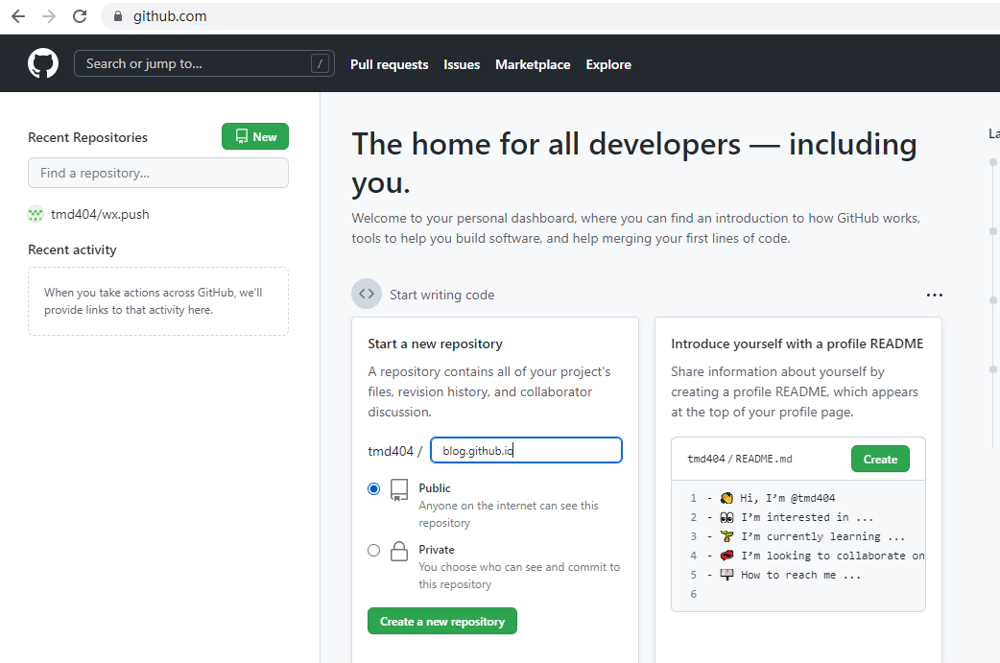

#### （1.2）然后新建一个空白README文件：

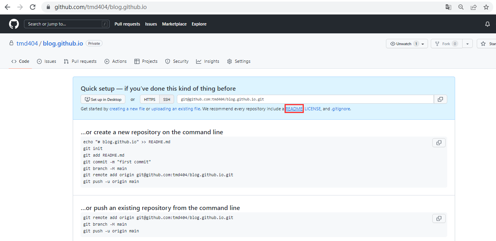

#### （1.3）随便输入点内容然后提交

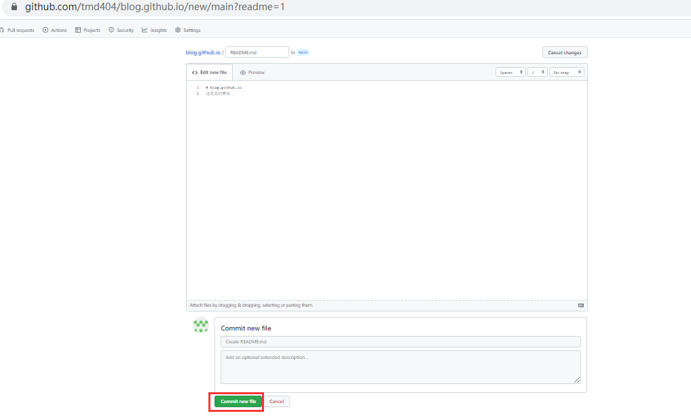

#### （1.4）如下所示博客仓库就搭建完成了：

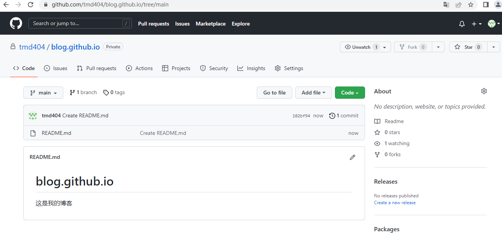

### 2.初步安装配置hexo：

#### （2.1）使用npm命令全局安装hexo框架：`$ npm install -g hexo-cli`

#### （2.2）查看全局安装存放位置：

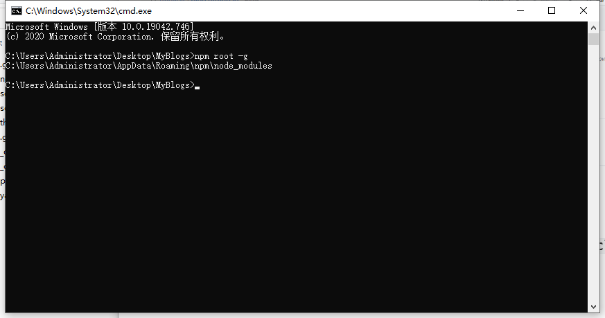

#### （2.3）进入hexo框架下的管理目录：

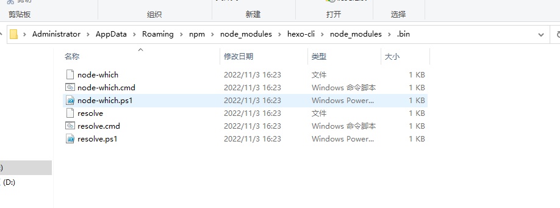

#### （2.4）将上一步2.3的目录地址添加到系统环境变量：

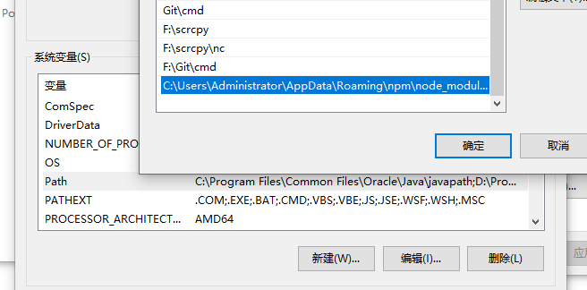

#### （2.5）检验是否添加环境变量成功：

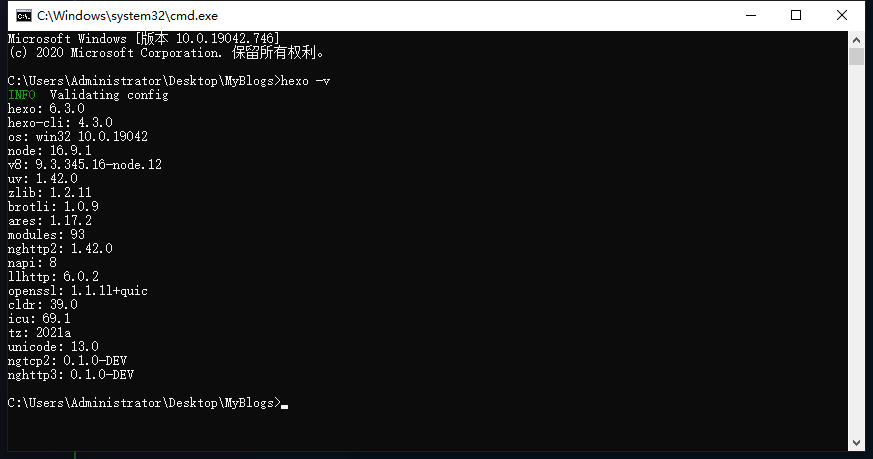

#### （2.6）初始化hexo`$ hexo init `

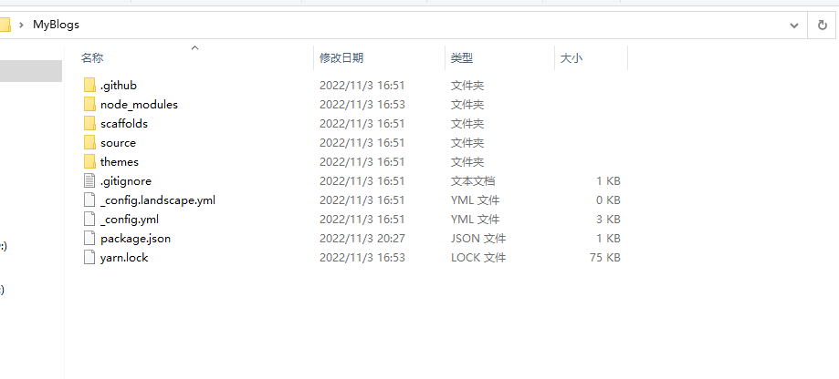

### 3.配置git和项目：

#### （3.1）已安装git的前提下在项目文件中打开Git Bash：

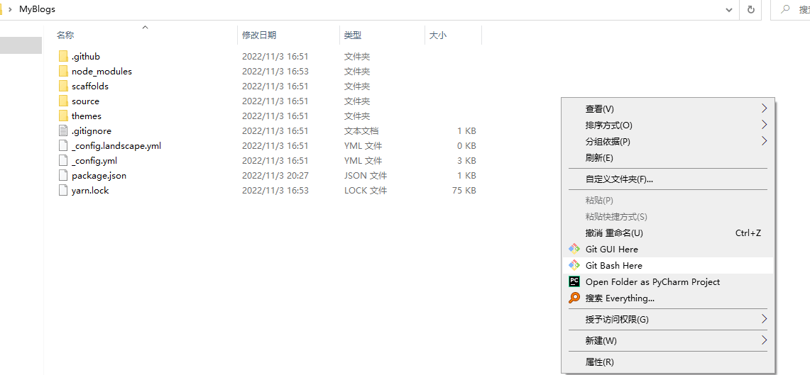

#### （3.2）在Bash中输入ssh查看是否安装有ssh：

#### （3.3）通过登录github的邮箱生成密钥：`$ ssh-keygen -t rsa -C "rabbits5201314.gmail.com"` （可以看到如下密钥存放位置）

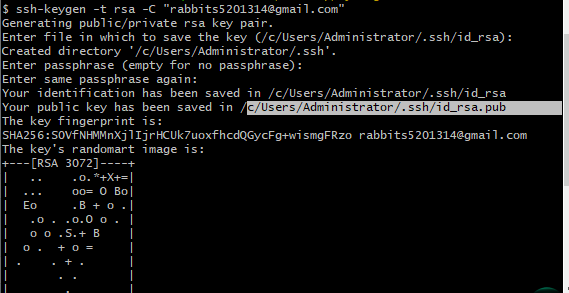

#### （3.4）根据上一步3.3的位置找到id_rsa.pub文件（用记事本打开Ctrl+a，Ctrl+c 复制密钥）

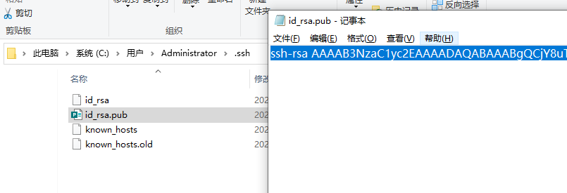

#### （3.5）将密钥粘贴到github的sshKey：

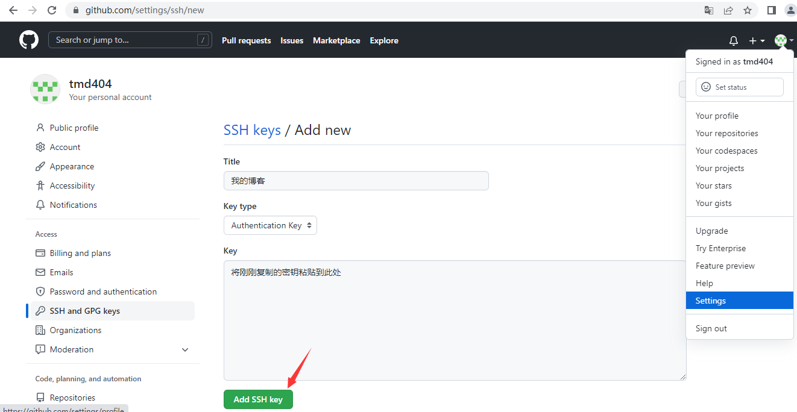

#### （3.6）创建完成如下显示：

#### 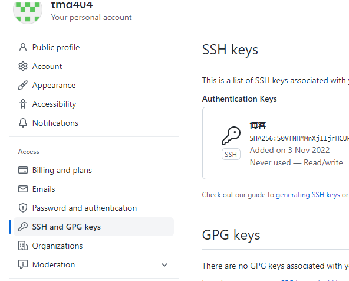

#### （3.7）打开git Bash输入命令连接github ：`$ ssh -T git@github.com`

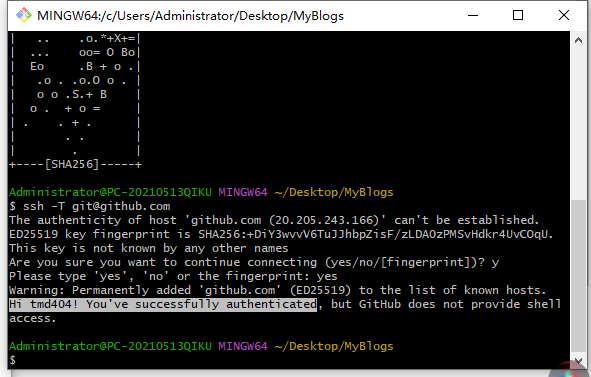

#### （3.8）打开本地服务并访问：`$ hexo s`

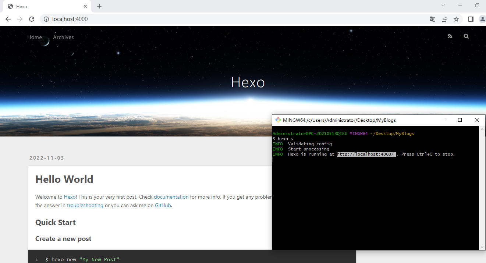

#### （3.9）修改 .yml配置文件：

`deploy:`
  `type: git	#类型`
  `repository: https://github.com/tmd404/tmd404.github.io.git	#博客项目地址`
  `branch: main	#分支`

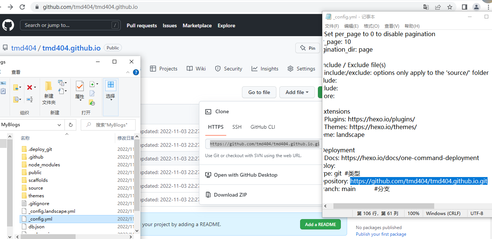

#### （3.10）下载hexo小工具：`$ npm install hexo-deployer-git --save`

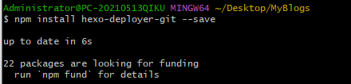

#### (3.11)下载项目界面文件：`$ hexo g`

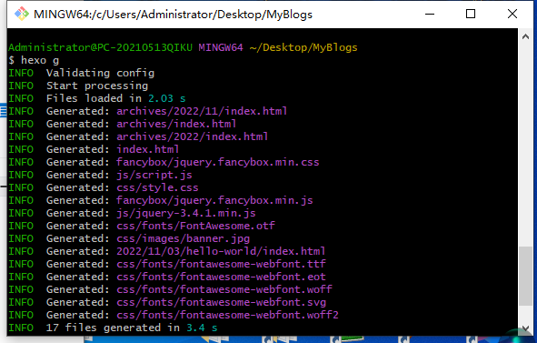

#### （3.12）上传项目到github，输入账号密码（密码需要使用令牌）：`$ hexo d`

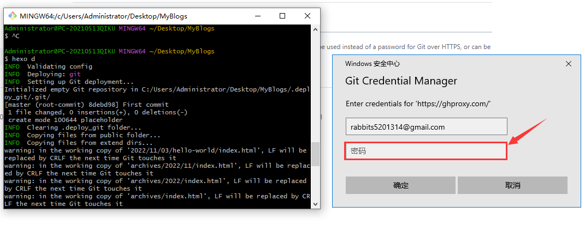

（3.13）添加令牌：

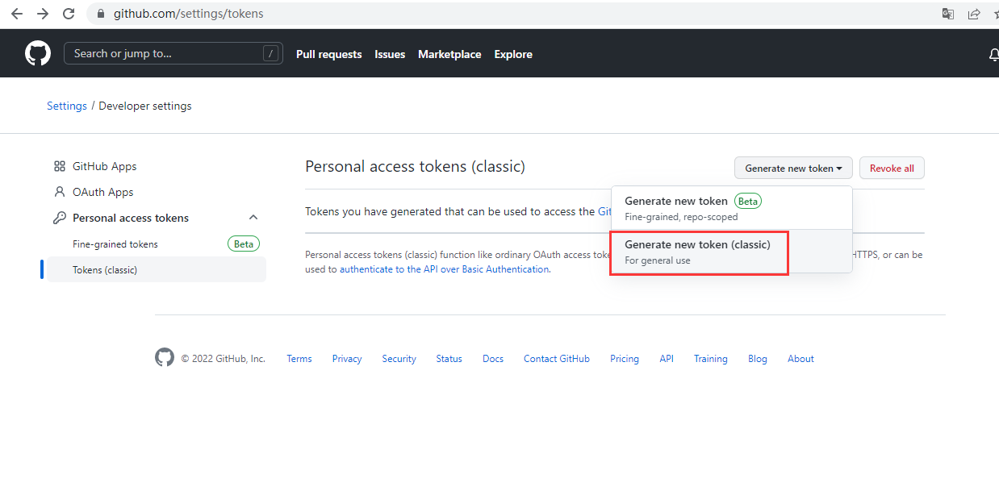

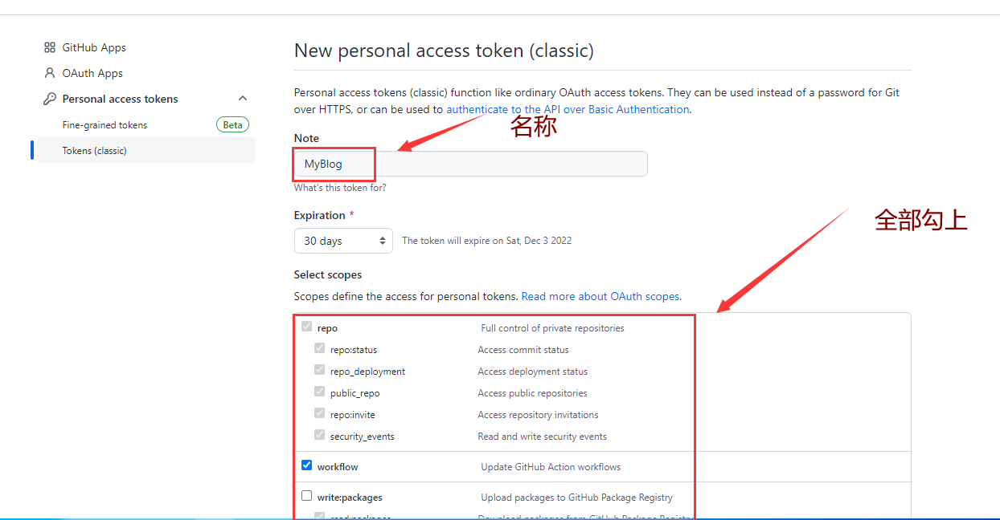

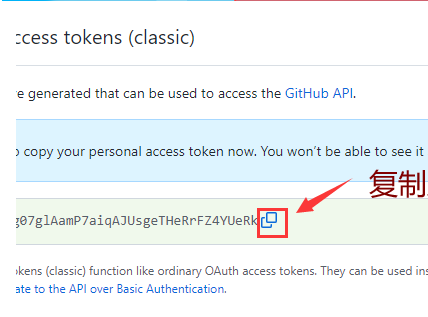

#### （3.14）粘贴复制的令牌后确定（建议将复制的令牌一份放在记事本中！！！！）：

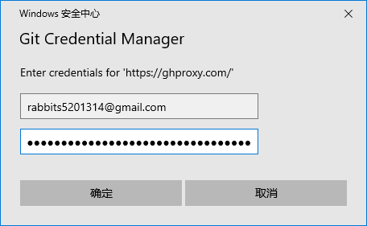

#### （3.15）项目上传完毕：

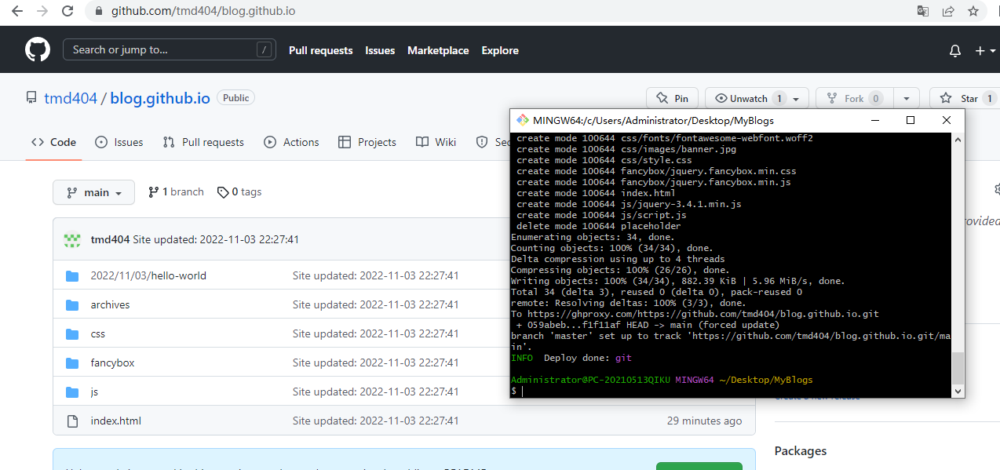

#### （3.16）pages页面配置博客访问地址（必须是 仓库名.github.io）:

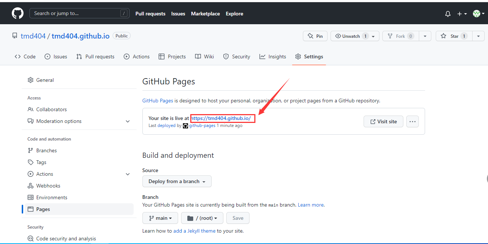

#### （3.17）进行访问（仓库名.github.io [tmd404.github.io]）:

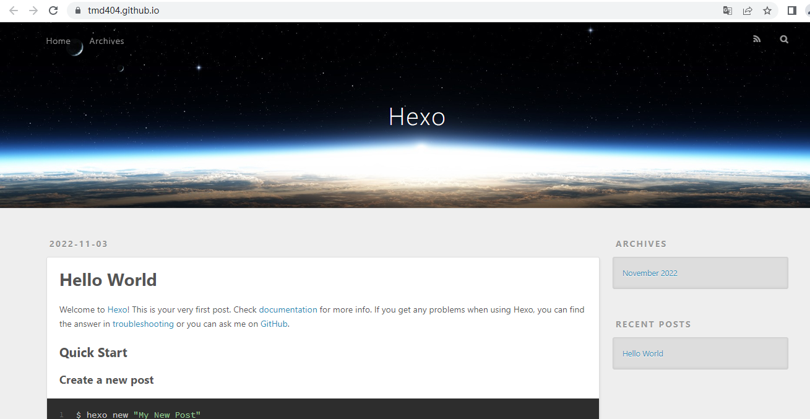

### 4.初始化配置完成

#### （4.1）个人主页：https://github.com/tmd404

#### （4.2）博客地址：https://tmd404.github.io/

#### （4.3）感谢大家的关注，初来乍到，如有不足敬请谅解，如果可以送上一个免费的Start吧！
